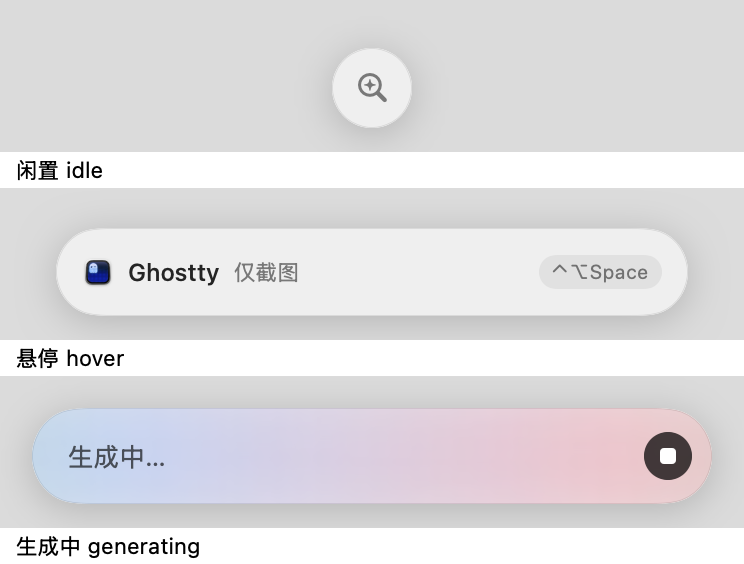

<p align="center">
  
</p>

<h1 align="center">Wisp</h1>

<p align="center">
  <strong>A native macOS AI assistant that reads your current screen and browser context when you ask.</strong>
</p>

<p align="center">
  <a href="https://github.com/ycl-2004/Wisp/releases/latest"></a>
  <a href="https://github.com/ycl-2004/Wisp/releases"></a>
  
  
  
  <a href="LICENSE"></a>
</p>

<p align="center">
  <a href="https://github.com/ycl-2004/Wisp/releases/latest/download/Wisp-macOS-universal.zip"><strong>⬇ Download for macOS</strong></a>
  ·
  <a href="https://github.com/ycl-2004/Wisp/releases">Releases</a>
  ·
  <a href="#features">Features</a>
  ·
  <a href="#privacy">Privacy</a>
  ·
  <a href="#build-from-source">Build from source</a>
  ·
  <a href="README.zh-CN.md">简体中文</a>
</p>

Wisp lives in the menu bar. Press `⌃⌥Space`, and it remembers the frontmost
app before its panel appears. It can then capture the current window and, when
the frontmost app is a supported browser, read the URL, title, selected text,
and page body. Ask a question without copying context between apps.

It is a local-first desktop shell around the model provider you choose:
OpenAI-compatible HTTP, Ollama, or the Codex CLI. Conversation text and
page-text snapshots are stored on your Mac; screenshots remain in memory for
the current request unless you explicitly enable debug capture. The interface
ships in English and Simplified Chinese and follows your system language.

> **Current distribution status:** the latest release is
> `v0.2.0 (build 4)`, a Universal 2 build with `arm64` and `x86_64` slices.
> Releases are ad-hoc signed and
> not Apple-notarized, so the first launch may require Control-click →
> **Open**.

> **What gets sent:** when you use a cloud provider, the full text of the page
> you are looking at and a screenshot of the current window go to the endpoint
> you configured. Exclusions are per application, not per site — see
> [PRIVACY.md](PRIVACY.md).

## Quick start

1. **[Download `Wisp-macOS-universal.zip`](https://github.com/ycl-2004/Wisp/releases/latest/download/Wisp-macOS-universal.zip)** and unzip it.
2. Move `Wisp.app` to `~/Applications` or `/Applications`.
3. On first launch, Control-click `Wisp.app`, choose **Open**, and confirm.
   The public build is not notarized, so a regular double-click may be blocked
   by Gatekeeper.
4. Grant **Screen Recording** permission in System Settings. The first time
   Wisp reads a browser page, grant Wisp **Automation** access to that browser.
5. Open **Settings → Model**, choose a provider, save it, and test the
   connection.
6. Return to the window you want to ask about and press `⌃⌥Space`.

If Control-click → **Open** is unavailable, clear the quarantine flag:

```bash
xattr -dr com.apple.quarantine "$HOME/Applications/Wisp.app"
open "$HOME/Applications/Wisp.app"
```

### System requirements

- macOS 14.0 or later.
- An Apple Silicon or Intel Mac. The published app is a Universal 2 binary.
- **Screen Recording** permission for current-window screenshots.
- **Automation** permission and the browser's `Allow JavaScript from Apple
  Events` setting for full-page browser text.
- Network access and your own API key for cloud endpoints.
- A running Ollama service for the Ollama provider.
- A locally installed and authenticated Codex CLI for the Codex provider.

## Why Wisp

- **Context is captured before the panel opens.** Wisp records the target app
  first, so the assistant panel does not accidentally become the subject of
  its own screenshot.
- **The request boundary is visible.** The header shows the current app,
  browser information, screenshot and page-text status, and conversation count.
- **Capture is on demand.** The always-available island tracks the current app
  but does not continuously record the screen or run browser scripts.
- **The model connection is yours.** Use a cloud-compatible endpoint, a local
  Ollama model, or your existing Codex CLI login.
- **Conversation retention is explicit.** Conversation and turn limits are
  configurable, and deletion is initiated by the user rather than hidden
  automatic cleanup.

## Features

**Screen and browser context**

- Capture the current frontmost application's window; screenshots are normally
  kept in memory only.
- Supports Chrome, Brave, Edge, Vivaldi, Yandex Browser, Opera, Safari, Arc,
  and selected stable or beta bundle identifiers.
- Read the current URL, page title, selected text, and page body from supported
  browsers.
- Report cross-origin iframe URLs and unavailable body text so the model does
  not assume that a page was fully read.
- Fall back explicitly to URL and screenshot context when JavaScript is
  disabled or the current app is not supported.

**Floating panel and island**

- A menu-bar app with no regular Dock window.
- Starts as a compact card and expands upward when needed; the conversation
  area scrolls within a bounded height.
- Supports dragging, resizing, Escape to collapse, and automatic collapse after
  leaving the panel.
- Optional launch at login, so the island is there after a restart.
- The persistent island shows the current app and context status. In its
  desktop form you can drag it anywhere on screen — it collapses to its small
  circle while you drag, so edges stay reachable — and it stays there across
  launches. Expanding follows the space available, growing inward from either
  edge instead of always from the middle. It can also snap to the Mac's camera
  notch.
- Available in English and Simplified Chinese. It follows the system language,
  and Settings → General can pin either language on its own.

**Model providers**

- **Cloud endpoint:** sends `chat/completions` requests with SSE streaming and
  `image_url` data URLs, supporting OpenAI, OpenRouter, and other compatible
  endpoints.
- **Ollama:** defaults to `http://localhost:11434/v1`, reads the model list
  from Ollama, and marks models that appear to support vision.
- **Codex CLI:** runs the local
  `codex exec --json --ephemeral --sandbox read-only` command without
  writing session files into Wisp's conversation directory.

**Startup and updates**

- Optional launch at login through `SMAppService`, with a direct link to Login
  Items & Extensions when macOS holds the item for approval.
- Optional update check that asks GitHub once per launch for the latest release
  tag. It sends nothing about you or your usage, never installs anything on its
  own, and can be switched off entirely.

**Local conversations**

- Keeps up to 10 conversations by default, with up to 30 user turns per
  conversation; both limits can be changed in Settings.
- Preserves the latest two turns in full and folds older context into summary
  rows.
- Limits page text to 60,000 characters, retaining the first 75% and last 25%
  when the page is longer.
- Stores conversations as readable JSON, decoded tolerantly so that a damaged
  record or a field added by a future version costs you that record rather than
  the whole history.
- Refuses to overwrite a conversation file written by a newer version of Wisp,
  and tells you when a file could not be read instead of quietly starting empty.
- At the conversation limit, offers to drop the least recently updated
  conversation by name rather than simply refusing to create a new one.
- Settings can delete all conversations and the saved API key.

## Usage

### Ask one question

```text
⌃⌥Space
  ↓ remember the current frontmost app
  ↓ capture the window; read browser URL, title, and page text when available
  ↓ show the panel and label the captured context
  ↓ ask a question → send it to the selected provider
  ↓ keep the conversation locally after the answer completes
```

### Shortcuts and controls

| Action | Default behavior |
| --- | --- |
| `⌃⌥Space` | Show or collapse the panel; configurable in Settings |
| `⌘↩` | Send |
| `⌘.` | Stop generation |
| `Esc` | Collapse the panel |
| Header `∧` / `∨` | Switch between compact card and expanded panel |
| Header `↻` | Refresh the current context |
| **Screenshot** chip | Include or exclude the screenshot from this request |
| **Info** chip | Explain what was captured for this request |
| Speech-bubble button | Open the conversation list |

Wisp refreshes context at three points: when the panel is shown, when the
frontmost app changes while the panel is open, and before sending if the
previous capture is older than 20 seconds or you have left the panel. It does
not automatically recapture while a response is generating.

### Choose a provider

Open the menu-bar icon → **Settings → Model**:

- **Cloud endpoint:** pick a provider — OpenRouter, Google Gemini, OpenAI,
  Anthropic, Zhipu GLM, or *Custom* for any other OpenAI-compatible address —
  then pick a model and enter that provider's API key. Choosing a provider
  fills in the Base URL and its model list for you. Keys are saved as you type,
  one per provider, in the macOS Keychain rather than the conversation JSON, so
  several providers stay configured side by side and switching never loses one.
- **Ollama:** start Ollama and refresh the model list. Only a vision-capable
  model can interpret a screenshot.
- **Codex CLI:** select a detected `codex` executable and optionally choose a
  model. Wisp uses your existing Codex login.

All three providers have **Save and test connection**. Cloud and Ollama tests
send a very small test image; the Codex test only checks whether
`codex --version` runs successfully.

## Screenshots

These images were generated by the current build's offline rendering entry
points. They contain no real desktop, conversation, or personal files. The
header image uses simulated Chrome page metadata; the SwiftUI `Menu` model
selector was cropped because it is not rendered by the offline ImageRenderer.

<table>
  <tr>
    <td align="center"><strong>Context header</strong><br></td>
  </tr>
  <tr>
    <td align="center"><strong>Persistent island: idle, hover, and generating states</strong><br></td>
  </tr>
</table>

To regenerate the checked-in images, use a **Debug** build — the rendering
entry points are compiled only into Debug, so that a shipped app cannot be
driven by another local process:

```bash
Build/Debug/Wisp.app/Contents/MacOS/Wisp --render-header docs/screenshots/context-header.png
Build/Debug/Wisp.app/Contents/MacOS/Wisp --render-island docs/screenshots/island-states.png
```

Add `-AppleLanguages '(en)'` or `-AppleLanguages '(zh-Hans)'` to render a
specific localization.

## Privacy

**Local storage**

- Conversation text and page-text snapshots:
  `~/Library/Application Support/Wisp/conversations.json`.
- API keys: stored in the macOS Keychain, outside Wisp's support directory.
- Screenshots: normally held in memory as the image attachment for the current
  request; they are not written to the conversation JSON.
- Optional debug files: when debug capture is enabled, Wisp writes
  `debug/last-context.json` and `debug/last-screenshot.jpg` under its
  application-support directory.

**Network boundary**

- The OpenAI-compatible provider sends the context you selected and the
  current screenshot to the Base URL you configured. The service's logs,
  retention, and privacy policy are outside Wisp's control.
- Ollama uses `localhost` by default. If you configure a remote Base URL, the
  request goes to that address.
- Wisp starts the local Codex process, creates a temporary directory for image
  input, uses `--ephemeral` and a read-only sandbox, and removes the
  temporary directory when the command ends. Codex's own account, network,
  and service-side logging are outside Wisp's control.
- If the update check is enabled, Wisp asks `api.github.com` once per launch
  for the latest release tag. The request carries no identifier beyond your IP
  address and a `Wisp/<version>` user agent, downloads nothing, and installs
  nothing. Turning it off makes no request at all.
- Wisp has no account system, sync service, analytics SDK, crash-reporting SDK,
  or background continuous-recording feature.

**Exclusions are per app, not per site.** The exclusion list takes bundle
identifiers, so there is currently no way to exempt one URL or domain while
still using Wisp in that browser.

The full policy is in [PRIVACY.md](PRIVACY.md).

**Permissions**

- **Screen Recording:** current-window screenshots.
- **Automation / Apple Events:** browser URL and title access, plus page
  JavaScript execution for supported browsers.
- **Network client:** cloud endpoints, remote Ollama, or networking performed
  by Codex itself.

## Current release

The current release is `0.2.0 (build 4)`; see
[CHANGELOG.md](CHANGELOG.md). It corresponds to Git tag `v0.2.0`.

| Artifact | Purpose |
| --- | --- |
| `Wisp-macOS-universal.zip` | macOS app containing `arm64` and `x86_64` |
| `Wisp-macOS-universal.zip.sha256` | SHA-256 checksum for the ZIP |

The Universal 2 package passed `lipo -info` checks for both architecture
slices. Release validation was performed on Apple Silicon; an Intel hardware
runtime regression has not yet been completed. The package is ad-hoc signed
and not Apple-notarized, so the first launch may require Control-click →
**Open**.

## FAQ

<details>
<summary>How do I move the island, and how do I change the app's language?</summary>

Hold and drag the island to anywhere on the desktop. While you drag it
collapses to its small circle and rides under the cursor, so you can push it
flush against a screen edge; when it expands again it grows toward whichever
side has room rather than always from the middle. It stays where you drop it,
remembers that position across launches, and is pulled back on screen if your
display arrangement changes. Settings → **Screen & Permissions** → Reset
position puts it back at the bottom center, and the same section can switch it
to the notch form, which stays anchored to the notch. Dragging the island never
moves the assistant panel — that still opens from the bottom center and keeps
its own position.

Wisp ships English and Simplified Chinese and follows your system language by
default. To pin one language regardless of the system setting, open
Settings → **General** → **Interface language** and pick it; Wisp offers to
restart, which is when the change takes effect. The setting affects Wisp alone
and leaves your system settings untouched.

The equivalent from a terminal, if you prefer:

```bash
defaults write com.yichenlin.Wisp AppleLanguages -array en
```

Use `zh-Hans` for Simplified Chinese, or
`defaults delete com.yichenlin.Wisp AppleLanguages` to follow the system again.
Restart Wisp afterwards.

</details>

<details>
<summary>I updated Wisp and it stopped capturing, or asked for permissions again</summary>

Releases are ad-hoc signed, which means each build has a different code
identity. macOS binds Screen Recording, Automation, and Keychain access to that
identity, so a new version can appear as a different app and lose the grants of
the old one. Re-grant Screen Recording under System Settings → Privacy &
Security, allow Automation for your browser the next time Wisp reads a page,
and re-enter the API key if the Keychain prompt is declined. Removing the stale
entry for the old build from the Screen Recording list keeps that list tidy.

This goes away once releases are signed with a Developer ID certificate and
notarized.

</details>

<details>
<summary>macOS says Wisp cannot be opened because the developer cannot be verified</summary>

The public build is ad-hoc signed and not Apple-notarized, so Gatekeeper may
block a plain double-click. Control-click `Wisp.app`, choose **Open**, and
confirm once. If the option is unavailable, run the `xattr` command shown in
[Quick start](#quick-start).

</details>

<details>
<summary>Why does the browser show a screenshot but no full-page text?</summary>

Check that Wisp has Automation permission, that the browser profile has
`Allow JavaScript from Apple Events` enabled, and that the page is not a
browser-internal page such as `chrome://`. Chrome stores this JavaScript
setting per profile. Cross-origin iframe body text may still be unavailable,
so the screenshot remains the fallback.

</details>

<details>
<summary>Does Wisp continuously record my screen?</summary>

No. The persistent island only tracks the current app. Screenshots are taken
when the panel is shown or context is refreshed, and completed-response
screenshots are not written to Wisp's conversation file.

</details>

<details>
<summary>How do I uninstall Wisp?</summary>

Quit Wisp from the menu-bar icon, then move `Wisp.app` to the Trash. To also
remove local conversations, preferences, and debug files, delete:

```text
~/Library/Application Support/Wisp/
```

The API key must also be removed from the **Data** settings page or deleted
from the macOS Keychain.

</details>

## Build from source

<details>
<summary>Requirements, development commands, and Universal 2 packaging</summary>

Requirements:

- macOS 14.0 or later.
- Xcode 26.6, the current verification environment, or a compatible version
  that provides a macOS 14 SDK.
- [XcodeGen](https://github.com/yonaskolb/XcodeGen) 2.45.4 or later, used to
  regenerate the Xcode project from `project.yml`.
- Swift Package Manager, which resolves `KeyboardShortcuts` 2.4.0 for the
  current lock state.

Build for local development:

```bash
xcodegen generate
xcodebuild -project Wisp.xcodeproj -scheme Wisp -configuration Debug build
cp -R Build/Debug/Wisp.app "$HOME/Applications/"
```

If your machine does not have the development team or signing identity in the
project, use an unsigned build for compile verification:

```bash
xcodebuild -project Wisp.xcodeproj -scheme Wisp -configuration Debug \
  CODE_SIGNING_ALLOWED=NO build
```

Build the Universal 2 release package:

```bash
rm -rf Build
xcodebuild -project Wisp.xcodeproj -scheme Wisp -configuration Release \
  -arch arm64 -arch x86_64 \
  ONLY_ACTIVE_ARCH=NO \
  CODE_SIGN_IDENTITY=- CODE_SIGNING_REQUIRED=YES build

mkdir -p dist
lipo -info Build/Release/Wisp.app/Contents/MacOS/Wisp
ditto --norsrc -c -k --keepParent \
  Build/Release/Wisp.app \
  dist/Wisp-macOS-universal.zip
shasum -a 256 dist/Wisp-macOS-universal.zip > dist/Wisp-macOS-universal.zip.sha256
```

`--norsrc` omits resource forks and AppleDouble `._` files. `--sequesterRsrc` is
also deliberately omitted: it stores resource forks in a `__MACOSX` folder
that users see next to the app after unzipping. The resulting archive is clean,
and the signature still verifies after a round trip.

The `lipo -info` output should list `arm64` and `x86_64`. Apple's
[Universal macOS binary documentation](https://developer.apple.com/documentation/apple-silicon/building-a-universal-macos-binary)
describes this two-architecture packaging model. Rosetta can run the
`x86_64` slice on Apple Silicon, but Intel hardware testing still needs to
be performed separately.

Release validation:

```bash
plutil -p Build/Release/Wisp.app/Contents/Info.plist
codesign --verify --deep --strict Build/Release/Wisp.app
unzip -l dist/Wisp-macOS-universal.zip
shasum -a 256 -c dist/Wisp-macOS-universal.zip.sha256
```

The current ad-hoc package was built and verified with the Release command,
bundle metadata checks, resource packaging checks, Universal architecture
checks, ZIP integrity checks, and SHA-256 verification. The repository does
not currently contain an automated test target or CI workflow.

</details>

## Project layout

- `Wisp/App/` — app entry point, menu-bar lifecycle, global shortcut, and
  diagnostic entry points.
- `Wisp/Capture/` — screen capture, browser AppleScript, page text, and
  context orchestration.
- `Wisp/LLM/` — OpenAI-compatible HTTP, Ollama, Codex CLI, SSE parsing, and
  prompt assembly.
- `Wisp/Store/` — local conversation JSON and macOS Keychain access.
- `Wisp/UI/` — floating panel, persistent island, chat, context header,
  conversation list, and Settings.
- `Wisp/Support/` — permissions, screen geometry, UserDefaults settings, login
  item, and update checking.
- `Wisp/Resources/` — the string catalog.
- `Wisp/Assets.xcassets/` — macOS app icon and image assets.
- `docs/screenshots/` — the current offline-rendered README screenshots.
- `project.yml` — XcodeGen project source, version settings, dependencies,
  localization configuration, and signing configuration.
- `LICENSE`, `THIRD-PARTY-NOTICES.txt`, `PRIVACY.md`, `CHANGELOG.md` — licence,
  bundled dependency notices, privacy policy, and release notes. The notice is
  copied from the repository root into the app bundle at build time.

## Versioning and releases

`project.yml` is the source of truth for `MARKETING_VERSION` and
`CURRENT_PROJECT_VERSION`; `Wisp.xcodeproj` is regenerated with XcodeGen.
The current release convention is:

1. Update the marketing version or build number in `project.yml`.
2. Run `xcodegen generate` and complete a Debug or Release build.
3. For a distributable build, verify both architecture slices, bundle metadata,
   signature, ZIP integrity, and checksum.
4. Create a `vX.Y.Z` Git tag and upload
   `Wisp-macOS-universal.zip` plus its `.sha256` file to the matching
   GitHub Release.

`Build/`, `dist/`, Xcode user state, diagnostics, and local environment
files are ignored by Git. Source, icon assets, project files, the package
resolution, and public documentation are tracked.

## Known limitations

- The current public package is ad-hoc signed and not Apple-notarized.
- The Universal 2 slices have been generated and checked on Apple Silicon, but
  the current release has not yet been run on an Intel Mac.
- Browser extraction depends on supported bundle identifiers, Automation
  permission, browser JavaScript settings, and page security boundaries.
- Codex CLI responses are returned as one completed response rather than
  token-by-token streaming, and each request carries Codex's own fixed context
  cost.
- The repository currently has no automated tests, CI workflow, or public
  notarization and release-signing pipeline.
- Because releases are ad-hoc signed, every build has a new code identity.
  macOS ties Screen Recording, Automation, and Keychain access to that identity,
  so updating the app can require granting those permissions again.
- App exclusions are per bundle identifier. There is no per-URL or per-domain
  exclusion, which is the exclusion most useful in a browser.
- Conversation history is stored as unencrypted JSON and is not evicted by age.
  At the default limits the file can reach roughly 50 MB, and it is rewritten in
  full on every message.
- The island can be dragged only in its desktop form; the notch form stays
  anchored to the notch.
- The island's circle can reach a screen edge but not overlap it, so its centre
  stops one radius (20pt) inside the edge.

## Credits

Wisp bundles [KeyboardShortcuts](https://github.com/sindresorhus/KeyboardShortcuts)
2.4.0 by Sindre Sorhus, under the MIT License. Its full notice ships inside the
app — Settings → General → **Open-source licenses** — and is checked in as
[THIRD-PARTY-NOTICES.txt](THIRD-PARTY-NOTICES.txt).

Everything else is written from scratch in SwiftUI and AppKit, with no other
third-party dependencies.

## License

Wisp is copyright © 2026 YC and available under the [MIT License](LICENSE).

## Links

- [GitHub repository](https://github.com/ycl-2004/Wisp)
- [Latest release](https://github.com/ycl-2004/Wisp/releases/latest)
- [Release assets](https://github.com/ycl-2004/Wisp/releases)
- [Issues](https://github.com/ycl-2004/Wisp/issues)
- [Release notes](CHANGELOG.md)
- [Privacy policy](PRIVACY.md)
- [Third-party notices](THIRD-PARTY-NOTICES.txt)
- [Simplified Chinese README](README.zh-CN.md)
