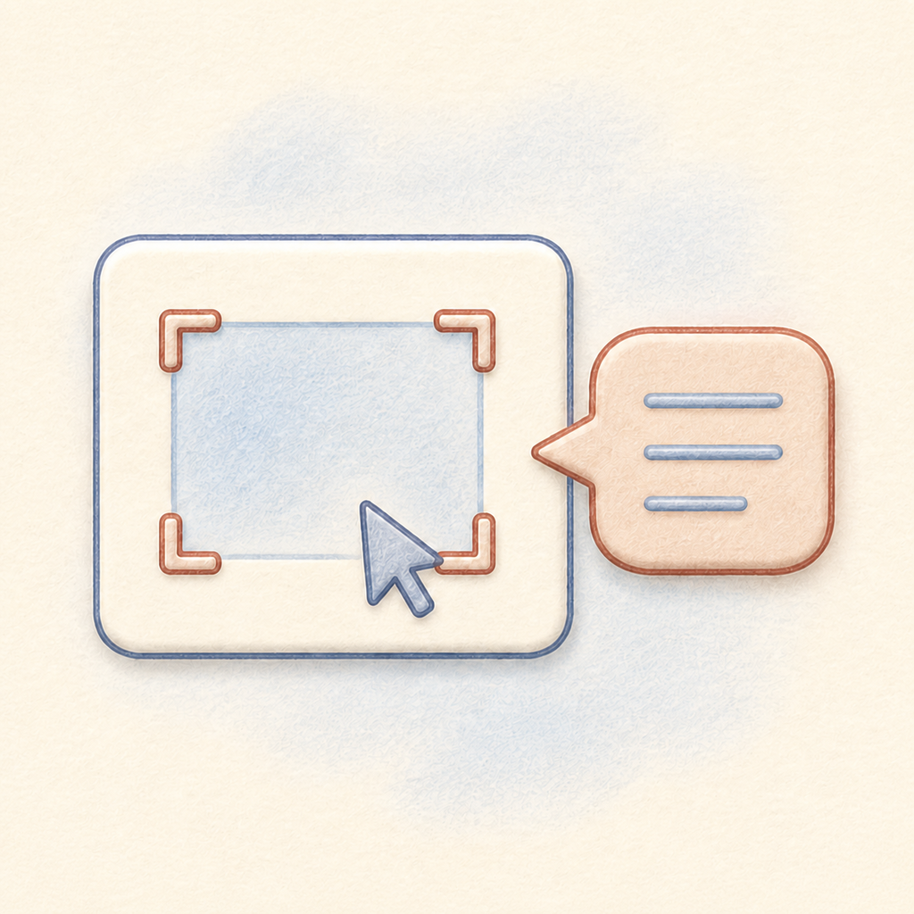

<p align="center">
  
</p>

<h1 align="center">Wisp</h1>

<p align="center">
  <strong>一个原生 macOS AI 助手：你问的时候，它才读你的屏幕和浏览器。</strong>
</p>

<p align="center">
  <a href="https://github.com/ycl-2004/Wisp/releases/latest"></a>
  <a href="https://github.com/ycl-2004/Wisp/releases"></a>
  
  
  
  <a href="LICENSE"></a>
</p>

<p align="center">
  <a href="https://github.com/ycl-2004/Wisp/releases/latest/download/Wisp-macOS-universal.zip"><strong>⬇ 下载 macOS 版</strong></a>
  ·
  <a href="https://github.com/ycl-2004/Wisp/releases">发布页</a>
  ·
  <a href="#功能">功能</a>
  ·
  <a href="#隐私">隐私</a>
  ·
  <a href="#从源码构建">从源码构建</a>
  ·
  <a href="README.md">English</a>
</p>

Wisp 常驻菜单栏。按下 `⌃⌥Space`，它会先记住此刻最前面的那个应用，然后才把面板显示出来。
接着它会截取当前窗口；如果最前面的是支持的浏览器，还会读出网址、标题、选中的文字和整页正文。
不用再在两个应用之间来回复制粘贴。

它是一层本地优先的桌面外壳，模型由你自己选：OpenAI 兼容接口、Ollama，或者 Codex CLI。
对话文字和页面文字快照存在你自己的 Mac 上；截图只在当次请求期间留在内存里，除非你自己打开调试采集。
界面提供简体中文和英文，跟随系统语言。

> **当前分发状态：** 最新版本是 `v0.2.0 (build 4)`，Universal 2 构建，含 `arm64` 与
> `x86_64`。发布包是 ad-hoc 签名、未经 Apple 公证，
> 首次打开可能需要按住 Control 点击 → **打开**。

> **会被发出去的东西：** 用云端接口时，你正在看的那一页的**整页正文**和当前窗口的**截图**
> 会发到你配置的地址。排除机制是按应用而不是按站点的 —— 详见 [PRIVACY.md](PRIVACY.md)。

## 快速开始

1. **[下载 `Wisp-macOS-universal.zip`](https://github.com/ycl-2004/Wisp/releases/latest/download/Wisp-macOS-universal.zip)** 并解压。
2. 把 `Wisp.app` 拖到 `~/应用程序` 或 `/应用程序`。
3. 首次启动请按住 Control 点击 `Wisp.app`，选择**打开**并确认。发布包未公证，直接双击可能被 Gatekeeper 拦下。
4. 在系统设置里授予**屏幕录制**权限。第一次读取浏览器页面时，再授予 Wisp 对该浏览器的**自动化**权限。
5. 打开**设置 → 模型**，选一种接法，保存并测试连接。
6. 切回你想提问的那个窗口，按 `⌃⌥Space`。

如果没有出现 Control 点击 → **打开** 的选项，清掉隔离标记：

```bash
xattr -dr com.apple.quarantine "$HOME/Applications/Wisp.app"
open "$HOME/Applications/Wisp.app"
```

### 系统要求

- macOS 14.0 或更高。
- Apple Silicon 或 Intel Mac。发布包是 Universal 2。
- 截取当前窗口需要**屏幕录制**权限。
- 读取浏览器整页正文需要**自动化**权限，以及浏览器里的 `Allow JavaScript from Apple Events` 开关。
- 云端接口需要联网和你自己的 API Key。
- Ollama 接法需要本机已经跑起 Ollama 服务。
- Codex 接法需要本机装好并已登录的 Codex CLI。

## 为什么是 Wisp

- **上下文在面板出现之前就采集好了。** Wisp 先记住目标应用，所以助手面板不会把自己截进去。
- **请求边界是看得见的。** 头部会显示当前应用、浏览器信息、截图与整页文字的状态，以及对话计数。
- **采集是按需的。** 常驻的小药丸只跟踪当前是哪个应用，不持续录屏，也不跑浏览器脚本。
- **模型连接是你自己的。** 云端兼容接口、本地 Ollama 模型，或者你已经登录的 Codex CLI。
- **保留多久由你说了算。** 对话数与轮数上限可配置，删除由你发起，没有藏起来的自动清理。

## 功能

**屏幕与浏览器上下文**

- 截取当前最前面应用的窗口；截图通常只留在内存里。
- 支持 Chrome、Brave、Edge、Vivaldi、Yandex、Opera、Safari、Arc，以及部分稳定版／测试版的 bundle id。
- 从支持的浏览器读取当前网址、页面标题、选中文字和整页正文。
- 会报告跨域 iframe 的地址和读不到的正文，免得模型以为整页都读到了。
- JavaScript 开关没开、或当前应用不受支持时，明确退回到「只有网址和截图」。

**浮动面板与小药丸**

- 菜单栏应用，没有常规的 Dock 窗口。
- 起始是一张紧凑卡片，需要时向上展开；对话区在有限高度内滚动。
- 支持拖动、缩放、Esc 收起，以及离开面板后自动收起。
- 可选登录时自动启动，重启之后药丸还在。
- 常驻小药丸显示当前应用与上下文状态。桌面形态下可以拖到屏幕任意位置并被记住；拖动时它会收成一颗小圆跟着光标走，所以贴得到屏幕边缘。展开时朝有空间的一侧长，而不是永远从中间往两边撑。也可以改成吸附在刘海上。
- 提供简体中文与英文。默认跟随系统语言，也可以在「设置 → 通用」里单独钉死一种。

**模型接法**

- **云端接口：** 以 SSE 流式发送 `chat/completions`，图片走 `image_url` data URL，兼容 OpenAI、OpenRouter 等。
- **Ollama：** 默认 `http://localhost:11434/v1`，直接读本机模型列表，并标出看起来支持读图的模型。
- **Codex CLI：** 运行本机的 `codex exec --json --ephemeral --sandbox read-only`，不往 Wisp 的对话目录里写会话文件。

**启动与更新**

- 可选的登录时自启，走 `SMAppService`；被系统拦下待批准时，设置里会直接给出「登录项与扩展」的入口。
- 可选的更新检查：每次启动向 GitHub 问一次最新版本号。不发送任何关于你或你使用情况的信息，不会自行下载或安装，也可以完全关掉。

**本地对话**

- 默认最多 10 个对话、每个对话 30 轮；两个上限都可以在设置里改。
- 最近两轮保留完整上下文，更早的折叠成摘要行。
- 页面正文上限 60,000 字，超出时保留头 75% 与尾 25%。
- 对话以可读 JSON 存储，并且是容错解码的：某条记录坏掉、或者将来的版本加了字段，代价是丢那一条，而不是整份历史。
- 拒绝覆盖由更新版本 Wisp 写出的对话文件；文件读不出来时会明确告诉你，而不是悄悄从空白开始。
- 到达对话上限时，会点名问你要不要顶掉最久没更新的那个，而不是直接不让新建。
- 设置里可以一次性删除全部对话与已保存的 API Key。

## 用法

### 问一个问题

```text
⌃⌥Space
  ↓ 记住当前最前面的应用
  ↓ 截取窗口；可用时读取浏览器网址、标题与整页正文
  ↓ 显示面板并标出这次采集到的上下文
  ↓ 提问 → 发给选定的接法
  ↓ 回答完成后把对话留在本机
```

### 快捷键与控件

| 操作 | 默认行为 |
| --- | --- |
| `⌃⌥Space` | 唤起或收起面板；可在设置里改 |
| `⌘↩` | 发送 |
| `⌘.` | 停止生成 |
| `Esc` | 收起面板 |
| 头部 `∧` / `∨` | 在紧凑卡片与展开面板之间切换 |
| 头部 `↻` | 重新读取当前上下文 |
| **截图**标签 | 决定这次请求带不带截图 |
| **说明**标签 | 解释这次采集到了什么 |
| 对话气泡按钮 | 打开对话列表 |

Wisp 会在三个时机刷新上下文：面板显示时、面板开着而最前面的应用变了时，以及发送前发现上次采集
已经超过 20 秒或你离开过面板时。回答正在生成时不会自动重新采集。

### 选择接法

菜单栏图标 → **设置 → 模型**：

- **云端接口：** 先选服务商 —— OpenRouter、Google Gemini、OpenAI、Anthropic、智谱 GLM，
  或者「自定义」填任意 OpenAI 兼容地址 —— 再选模型、填这一家的 API Key。
  选了服务商，Base URL 和模型列表会自动带出来。Key 边填边存、按服务商分开放在 macOS
  钥匙串，不写进对话 JSON，所以几家可以同时配好随时切，切换也不会把 Key 弄丢。
- **Ollama：** 启动 Ollama 后刷新模型列表。只有能读图的模型才看得懂截图。
- **Codex CLI：** 选中检测到的 `codex` 可执行文件，可选地指定模型。用的是你已有的 Codex 登录。

三种接法都有**保存并测试连接**。云端和 Ollama 的测试会发一张很小的测试图；Codex 的测试只检查
`codex --version` 能不能跑通。

## 隐私

**本地存储**

- 对话文字与页面文字快照：`~/Library/Application Support/Wisp/conversations.json`。
- API Key：存在 macOS 钥匙串，不在 Wisp 的应用支持目录里。
- 截图：通常只作为当次请求的图片附件留在内存，不会写进对话 JSON。
- 可选的调试文件：打开调试采集后，会在应用支持目录下写 `debug/last-context.json` 与 `debug/last-screenshot.jpg`。

**网络边界**

- 云端接口会把你选定的上下文和当前截图发到你配置的 Base URL。对方的日志、留存策略和隐私条款不在 Wisp 的控制范围内。
- Ollama 默认走 `localhost`。如果你把 Base URL 指到远端，请求就会发到那里。
- Codex 接法由 Wisp 启动本地 codex 进程，为图片输入建一个临时目录，以 `--ephemeral` 和只读沙箱运行，命令结束后删除该目录。Codex 自己的账号、网络和服务端日志不在 Wisp 的控制范围内。
- 打开更新检查时，Wisp 每次启动向 `api.github.com` 请求一次最新版本号。除了 IP 和 `Wisp/<版本>` 这个 UA 之外不带任何标识，不下载也不安装。关掉就完全不请求。
- Wisp 没有账号体系、同步服务、统计 SDK、崩溃上报 SDK，也没有后台持续录制。

**排除是按应用、不是按站点的。** 排除列表填的是 bundle id，所以目前没有办法在继续使用某个浏览器的
同时，单独豁免某一个网址或域名。

完整条款见 [PRIVACY.md](PRIVACY.md)。

**权限**

- **屏幕录制：** 截取当前窗口。
- **自动化 / Apple Events：** 读取浏览器网址与标题，以及在支持的浏览器里执行取文脚本。
- **网络客户端：** 云端接口、远程 Ollama，或 Codex 自身的网络行为。

## 当前版本

当前版本是 `0.2.0 (build 4)`，见 [CHANGELOG.md](CHANGELOG.md)，对应 Git 标签
`v0.2.0`。

| 文件 | 用途 |
| --- | --- |
| `Wisp-macOS-universal.zip` | 含 `arm64` 与 `x86_64` 的 macOS 应用 |
| `Wisp-macOS-universal.zip.sha256` | 该 ZIP 的 SHA-256 校验值 |

Universal 2 包通过了两个架构切片的 `lipo -info` 检查。发布验证在 Apple Silicon 上完成，
Intel 硬件上的运行时回归尚未做。包是 ad-hoc 签名、未经 Apple 公证，首次打开可能需要
Control 点击 → **打开**。

## 常见问题

<details>
<summary>怎么移动小药丸？怎么改界面语言？</summary>

按住药丸拖动，就能把它放到桌面上任何位置。拖动时它会收成一颗小圆并跟着光标走，所以可以一直推到屏幕
边缘；重新展开时会朝还有空间的那一侧长，而不是永远从中间撑开。松手即记住，重开也在那儿；
显示器布局变了会被拉回屏内。
**设置 → 屏幕与权限 → 回到默认位置** 可以放回底部居中，同一段里也可以切换成吸附刘海的形态
（刘海形态固定在刘海上，不可拖动）。拖动药丸不会影响助手面板 —— 面板仍然从底部中间展开，
并且记住它自己的位置。

Wisp 提供简体中文和英文，默认跟随系统语言。想不管系统设置、固定用某一种语言，打开
**设置 → 通用 → 界面语言** 选一个即可；Wisp 会提示重启，重开之后生效。这个设置只影响
Wisp 自己，不会动你的系统设置。

也可以在终端里改：

```bash
defaults write com.yichenlin.Wisp AppleLanguages -array zh-Hans
```

换成 `en` 即为英文；`defaults delete com.yichenlin.Wisp AppleLanguages` 可以恢复跟随系统。
改完请重启 Wisp。

</details>

<details>
<summary>升级之后读不到屏幕了，或者又要重新授权</summary>

发布包是 ad-hoc 签名的，也就是说每次构建的代码身份都不一样。macOS 把屏幕录制、自动化和钥匙串
访问都绑在这个身份上，所以新版本可能被当成另一个应用，拿不到旧版本的授权。请到「系统设置 →
隐私与安全性」重新勾选屏幕录制，下次读取网页时重新允许对浏览器的自动化，钥匙串弹窗如果被拒
则重新填一次 API Key。顺手把列表里旧构建那条陈旧记录删掉会清爽一些。

等发布改用 Developer ID 证书签名并公证之后，这个问题就没有了。

</details>

<details>
<summary>macOS 提示无法打开，因为无法验证开发者</summary>

公开构建是 ad-hoc 签名、未经 Apple 公证的，Gatekeeper 可能拦下直接双击。按住 Control 点击
`Wisp.app`，选择**打开**并确认一次即可。如果没有这个选项，执行[快速开始](#快速开始)里的
`xattr` 命令。

</details>

<details>
<summary>浏览器里只有截图，读不到整页文字</summary>

整页正文要靠向浏览器注入脚本才能拿到，这需要两件事：一是系统的**自动化**权限，二是浏览器自己的
`Allow JavaScript from Apple Events` 开关。Chromium 系的这个开关**每个配置文件要各开一次**
（菜单栏 View → Developer），Safari 在 Develop 菜单里且不分配置文件。没开的时候 Wisp 会明确
告诉你，并且只发网址和截图。

</details>

<details>
<summary>Wisp 会一直录我的屏幕吗？</summary>

不会。采集只发生在你按快捷键、点刷新，或者面板开着时你切到了别的应用这三种情况下。面板关着的时候
不采集。常驻的小药丸只跟踪当前是哪个应用，不截图也不跑浏览器脚本。

</details>

<details>
<summary>怎么卸载 Wisp？</summary>

退出 Wisp，然后删掉这些：

```bash
rm -rf "$HOME/Applications/Wisp.app"
rm -rf "$HOME/Library/Application Support/Wisp"
defaults delete com.yichenlin.Wisp
```

钥匙串里的 API Key 在「钥匙串访问」里搜 `com.yichenlin.Wisp` 删除，或者卸载之前先在
**设置 → 数据 → 删除全部对话与 API Key** 里清掉。另外记得到「系统设置 → 隐私与安全性」里
把屏幕录制和自动化的条目也移除。

</details>

## 从源码构建

<details>
<summary>依赖、开发命令与 Universal 2 打包</summary>

依赖：

- macOS 14.0 或更高。
- Xcode 26.6（当前验证环境），或其他提供 macOS 14 SDK 的兼容版本。
- [XcodeGen](https://github.com/yonaskolb/XcodeGen) 2.45.4 或更高，用于从 `project.yml` 重新生成 Xcode 工程。
- Swift Package Manager，按当前锁定状态解析 `KeyboardShortcuts` 2.4.0。

本地开发构建：

```bash
xcodegen generate
xcodebuild -project Wisp.xcodeproj -scheme Wisp -configuration Debug build
cp -R Build/Debug/Wisp.app "$HOME/Applications/"
```

打 Universal 2 发布包：

```bash
rm -rf Build
xcodebuild -project Wisp.xcodeproj -scheme Wisp -configuration Release \
  -arch arm64 -arch x86_64 \
  ONLY_ACTIVE_ARCH=NO \
  CODE_SIGN_IDENTITY=- CODE_SIGNING_REQUIRED=YES build

mkdir -p dist
lipo -info Build/Release/Wisp.app/Contents/MacOS/Wisp
ditto --norsrc -c -k --keepParent \
  Build/Release/Wisp.app \
  dist/Wisp-macOS-universal.zip
shasum -a 256 dist/Wisp-macOS-universal.zip > dist/Wisp-macOS-universal.zip.sha256
```

这里使用 `--norsrc` 排除资源分叉和 AppleDouble `._` 文件，也故意不加
`--sequesterRsrc`：后者会把资源分叉塞进一个 `__MACOSX` 目录，用户解压后就会看到它。
这样生成的压缩包是干净的，而且往返之后签名依然可以验证。

诊断入口（`--dump-context`、`--show`、`--render-*`）只编进 Debug 构建。发布版里留着它们，
等于把已经拿到的屏幕录制授权借给任何本地进程。要重新生成 README 里的截图，请用 Debug 构建：

```bash
Build/Debug/Wisp.app/Contents/MacOS/Wisp --render-header docs/screenshots/context-header.png
Build/Debug/Wisp.app/Contents/MacOS/Wisp --render-island docs/screenshots/island-states.png
```

加上 `-AppleLanguages '(en)'` 或 `-AppleLanguages '(zh-Hans)'` 可以指定渲染哪种语言。

发布验证：

```bash
plutil -p Build/Release/Wisp.app/Contents/Info.plist
codesign --verify --deep --strict Build/Release/Wisp.app
unzip -l dist/Wisp-macOS-universal.zip
shasum -a 256 -c dist/Wisp-macOS-universal.zip.sha256
```

</details>

## 目录结构

- `Wisp/App/` — 应用入口、菜单栏生命周期、全局快捷键，以及诊断入口。
- `Wisp/Capture/` — 屏幕采集、浏览器 AppleScript、页面取文与上下文编排。
- `Wisp/LLM/` — OpenAI 兼容 HTTP、Ollama、Codex CLI、SSE 解析与提示词组装。
- `Wisp/Store/` — 本地对话 JSON 与 macOS 钥匙串访问。
- `Wisp/UI/` — 浮动面板、常驻药丸、对话、上下文头部、对话列表与设置。
- `Wisp/Support/` — 权限、屏幕几何、UserDefaults 设置、登录项与更新检查。
- `Wisp/Resources/` — 字符串目录。
- `Wisp/Assets.xcassets/` — macOS 应用图标与图片资源。
- `docs/screenshots/` — README 里那几张离线渲染的截图。
- `project.yml` — XcodeGen 工程源、版本设置、依赖、本地化与签名配置。
- `LICENSE`、`THIRD-PARTY-NOTICES.txt`、`PRIVACY.md`、`CHANGELOG.md` — 许可证、依赖声明、隐私政策与发布说明。第三方声明在构建时从仓库根目录复制进 App 包。

## 版本与发布

`project.yml` 是 `MARKETING_VERSION` 与 `CURRENT_PROJECT_VERSION` 的唯一来源；
`Wisp.xcodeproj` 由 XcodeGen 重新生成。当前的发布约定是：

1. 在 `project.yml` 里更新版本号或构建号。
2. 跑 `xcodegen generate`，并完成一次 Debug 或 Release 构建。
3. 要出分发包的话，验证两个架构切片、bundle 元数据、签名、ZIP 完整性和校验值。
4. 打 `vX.Y.Z` 标签，把 `Wisp-macOS-universal.zip` 和它的 `.sha256` 传到对应的 GitHub Release。

`Build/`、`dist/`、Xcode 用户状态、诊断文件和本地环境文件都不进 Git。源码、图标资源、
工程文件、包解析结果和公开文档会被追踪。

## 已知限制

- 当前公开包是 ad-hoc 签名、未经 Apple 公证的。
- Universal 2 的两个切片已经生成并检查过，但当前发布尚未在 Intel Mac 上实机跑过。
- 浏览器取文依赖受支持的 bundle id、自动化权限、浏览器 JavaScript 设置以及页面本身的安全边界。
- Codex CLI 的回答是一次性返回的，没有逐字流式，而且每次请求都带着 Codex 自己的固定上下文开销。
- 仓库目前没有自动化测试、CI 流程，也没有公开的公证与发布签名流水线。
- 因为发布包是 ad-hoc 签名，每次构建都是新的代码身份。macOS 把屏幕录制、自动化和钥匙串访问绑在这个身份上，所以升级之后可能需要重新授权。
- 应用排除是按 bundle id 的。没有按网址或域名的排除，而后者恰恰是浏览器里最有用的那种。
- 对话历史以未加密 JSON 存储，且不按时间淘汰。在默认上限下文件最大约 50 MB，并且每写一条消息都会整份重写。
- 药丸只有桌面形态可以拖动；刘海形态固定吸附在刘海上。
- 小圆能贴到屏幕边缘但不能超出去，所以它的圆心最多停在距边缘一个半径（20pt）的位置。

## 致谢

Wisp 内置了 Sindre Sorhus 的
[KeyboardShortcuts](https://github.com/sindresorhus/KeyboardShortcuts) 2.4.0，MIT 许可证。
完整声明随应用一起分发 —— **设置 → 通用 → 开源许可** —— 并作为
[THIRD-PARTY-NOTICES.txt](THIRD-PARTY-NOTICES.txt) 一起提交在仓库里。

其余部分都是用 SwiftUI 和 AppKit 从头写的，没有其他第三方依赖。

## 许可证

Wisp 版权所有 © 2026 YC，以 [MIT 许可证](LICENSE)发布。

## 链接

- [GitHub 仓库](https://github.com/ycl-2004/Wisp)
- [最新发布](https://github.com/ycl-2004/Wisp/releases/latest)
- [全部发布](https://github.com/ycl-2004/Wisp/releases)
- [Issues](https://github.com/ycl-2004/Wisp/issues)
- [发布说明](CHANGELOG.md)
- [隐私政策](PRIVACY.md)
- [第三方许可](THIRD-PARTY-NOTICES.txt)
- [English README](README.md)
